# CiviWiki Key Functionality Report

## Executive Summary 
	
CiviWiki is a online web system designed to help communities discuss local problems, discover solutions, and enact change. To make this possible, we have created a novel discussion platform where users propose problems, causes, or solutions to issues. Each of these posts, called a “Civi” is linked to related posts, allowing users to debate each point, and allowing CiviWiki to intelligently lead users through the discussion - as users rate their agreement. Below is a series of screenshots with brief descriptions highlighting the key pages and functions on CiviWiki. 

## Global navigation

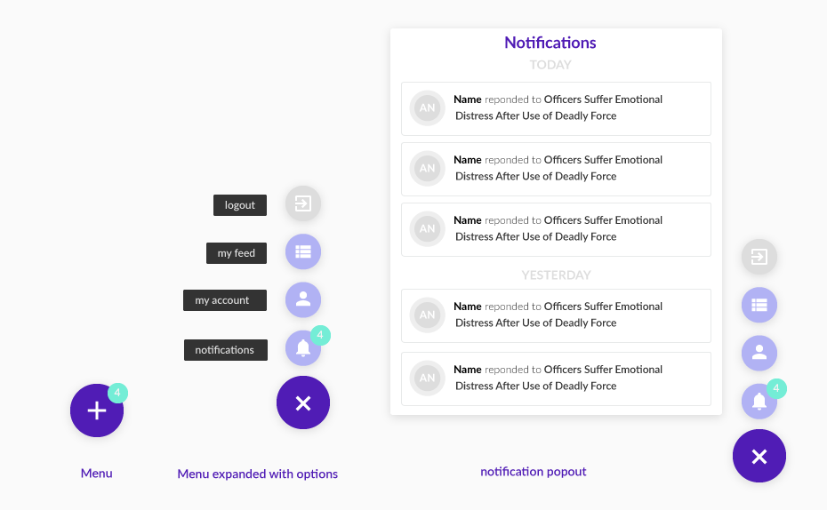

To save space and simplify our top page navigation features, CiviWiki replaced a traditional navigation bar with a floating action button. This button highlights relevant notifications about the issues the user has participated in and provides the user with tools to see their notification, as well as to visit their account, their feed, and to logout of CiviWiki. Though CiviWiki is not yet mobile friendly, this feature will allow for continuity between a desktop and mobile application. 
*Note, key notifications include a response to your post, your post being flagged, a bill being added to a solution Civi you agreed to, a voting statement added to a bill on a civi you agreed to etc. 

**Update**: Working to rework this into a more traditional Nav bar 

## The feed

CiviWiki’s home screen is a feed page that helps the user find relevant issue articles. The main body of the page shows a list of articles which can be sorted by customizable topic tabs at the top of the screen. The displayed articles are promoted if it has contributions from a someone a user follows, and can be further sorted by activity and time. All these articles are keyword searchable, and if you can’t find the issue you are looking for, you can open a new issue article with the button at the top left of the screen.  

**Note:** styling preference: darker purple and a colored tab bar. 

## The Issue Article 
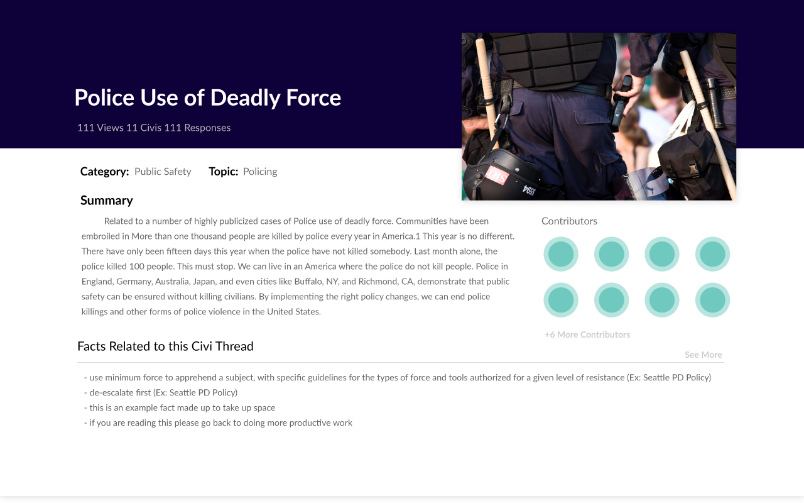

At the top of each issue article is a summary section which includes the title, activity statistics, organizational tags, a summary of the scope of the discussion, contributors, and key facts.  As you scroll down, the summary section minimizes into a narrow bar with little more than the title of the issue article and its topic/tags - exposing the CiviWiki discussion thread. 

**Note1:** this page will be publically editable and facts will be drawn from references in top rated Civies with users organizing them into relevant subject areas. 

**Note2:** Change “Category” to Topic and “Topic” to Tag. 

**Note3:** Add a sharing button to share article on Facebook/twitter/etc

**Update:** Deleting this page and minimizing content to fit onto the feed page 

## The thread
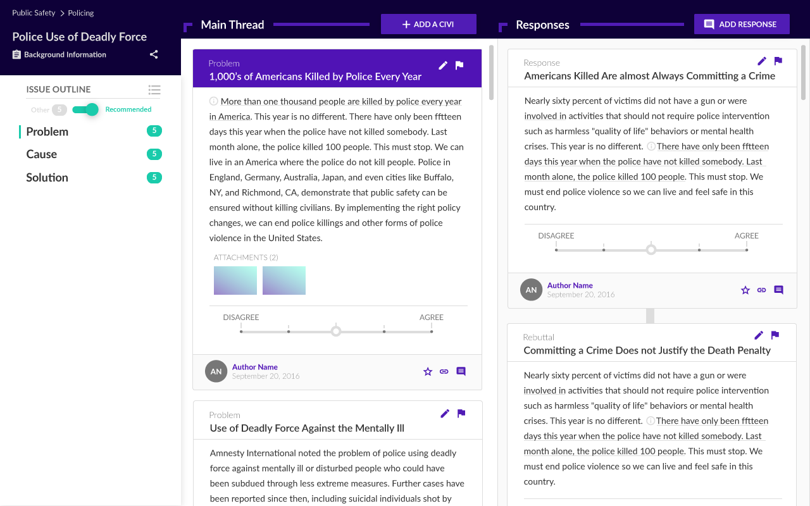

The issue thread is the most feature dense part of CiviWiki. With important content in the left outline column, the center main thread and the right response section. 

1. The outline column is an organizational tool to help navigate and track your progress in the thread.
2. The main thread column is the main content area for the thread. 
3. The response section is a supplementary content section which displays responses to the current Civies and converts to a form to add additional content to the thread.

## The Outline Section

The number displayed beside the problem, cause and solution outline title displays the number of relevant Civies based on your agreement or disagreement with earlier Civies. As you agree with Civies, the green number rises to reflect the number of potential Civies linked to those you have agreed with. This helps you focus your reading on content that will lead you to solutions you are likely to agree with. 

The grey number is the opposite of the green number and rises as you disagree with Civies. It representing the Civies you are unlikely to agree with because you disagreed with a prior Civi they are based on. If you are interested in reading and responding to these Civies, you can toggle the button to view those Civies. 

**Note1:** in the case that a Civi is linked to multiple earlier Civies and the user disagrees with one, but agrees with the other, the Civi will error towards the recommended list (in the future our ranking algorithm may down-promote the Civi based on the disagree with half the earlier Civies it is linked to) 

**Note2:** Outdated Styling and it might look good to make the grey a shade of red? 

## The Outline Section Expanded
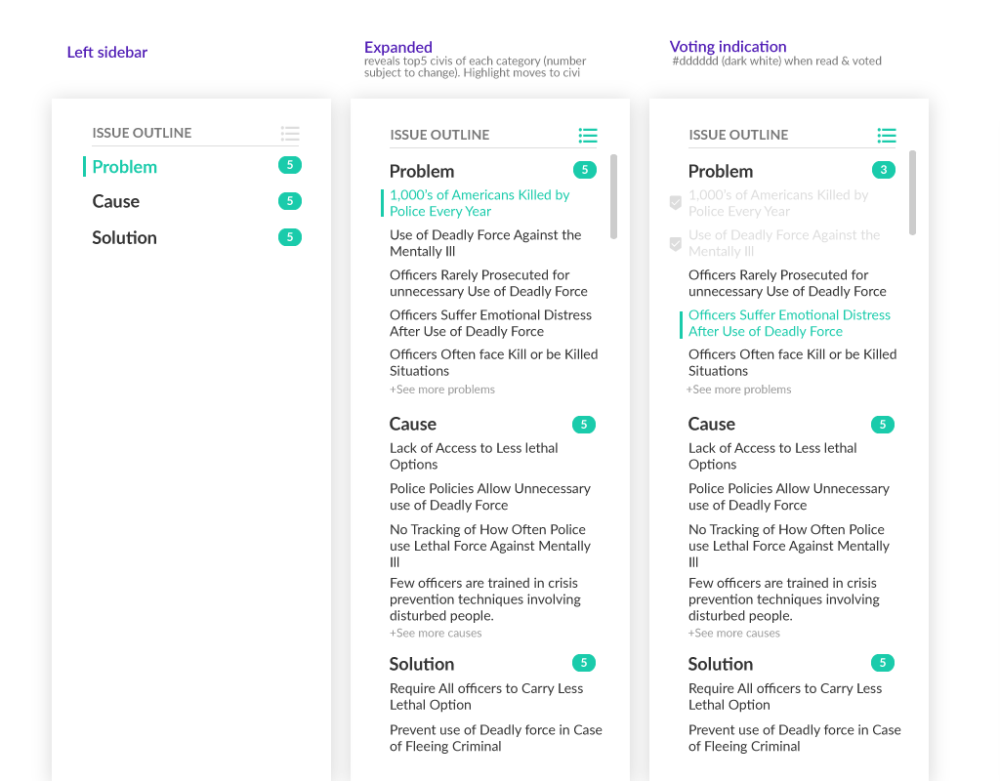

To simplify the issue thread screen, the outline section defaults to a collapsed setting. But, when expanded, it shows the top 5 titles of each category of Civi you can view in the main section and it highlights the current active Civi. 

As you vote on Civies, the titles of each Civi are marked with a check and a greying of the text. Finally, all of these titles serve as hyperlinks allowing you to quickly navigate to the relevant section of the thread. 

**Note:** missing Recommended/Other Toggle

## The main thread
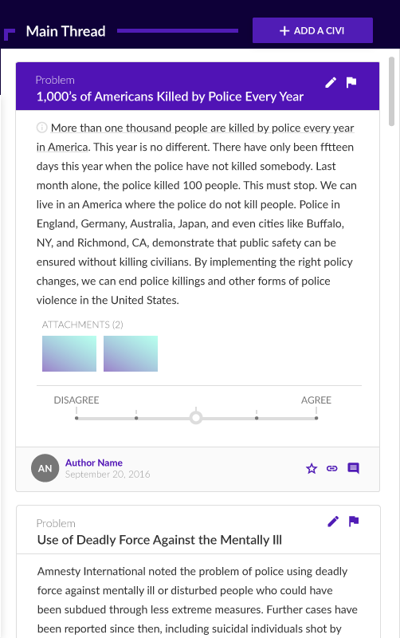

The main thread is a scrolling list of the top rated civies. Who you follow, past voting on the Civies, and your votes on prior Civies impact the ranking of this column. As you scroll down through this list, the top civi is activated (designated by purple header), and the response section shifts to reflect its responses. All civies in the main thread and response section have uniform features explained below. 

**Note:** Final Styling

## The Civi - Main Features
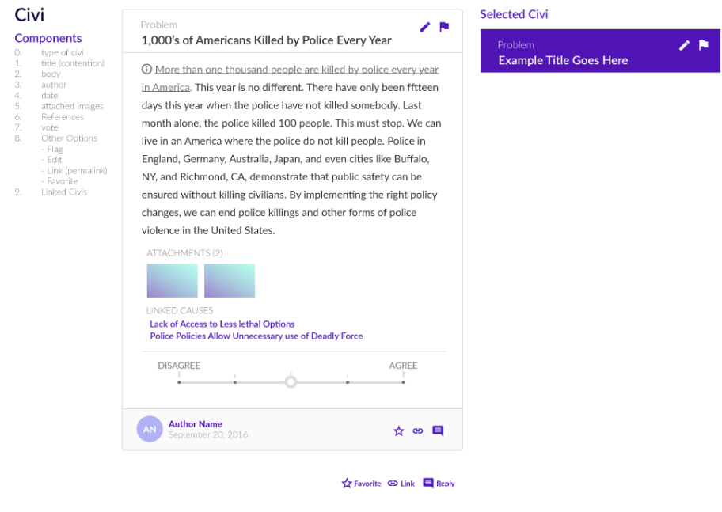

The Civi contains many features. Starting at the top of the card, and reading left to right: 
1. the Civi is labeled as problem/cause/solution/response/rebuttal/voting-statement
2. the pen allows the author to edit
3. the flag allows users to highlight violations of community guidelines or factual issues.
4. The title is the contention the user agrees or disagrees with. 
5. The body of test supports that with in-line citations. 
6. The attachments expand to show images. 
7. The links reference the chain of content the Civi is linked to. 
8. The rating scale allows users to rate their agreement with the contention. 
9. The author’s username and date of creation are saved at the bottom left
10. The civi can be starred
11. Its link can be saved and shared.
12. And the reply button is an alternative way to add a response Civi. 
**Note:** we may not need the reply button. 

## The Civi - Flagging
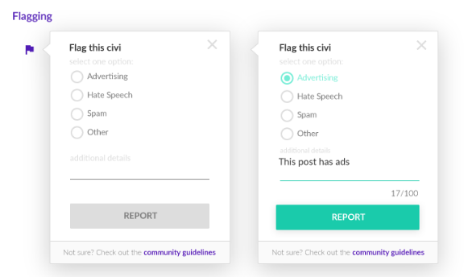

If the flagging button is selected. A small form appears with a few options for why the Civi violates community guidelines. Advertising, hate speech, and spam are a few obvious problems, but this form will develop with community feedback. 

This content will be forwarded to an admin. In future iterations we may place community member in charge of factual disputes for different topics. 

**Note:** need to add button for adding a factual dispute. 

## The Civi - Factual Disputes. 
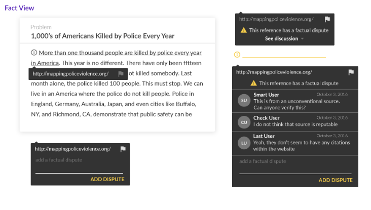

If a factual dispute is opened by an admin, the content of the dispute will be visible in hovering boxes if the relevant sentence/sentences is/are selected. 

**Note:** Dan, the actual factual dispute should be in the response column and just follow a simple comment reply system.

## Adding a Civi (General) 

If you select the Add Civi button, the response section morphs into a four part form to add a Civi. We chose a four part form to express the levity of adding a Civi, hoping to inspire higher quality content. 

**Note:** outdated styling “Main thread/Response Bubbles” 

## Adding a Civi (Step 1) 
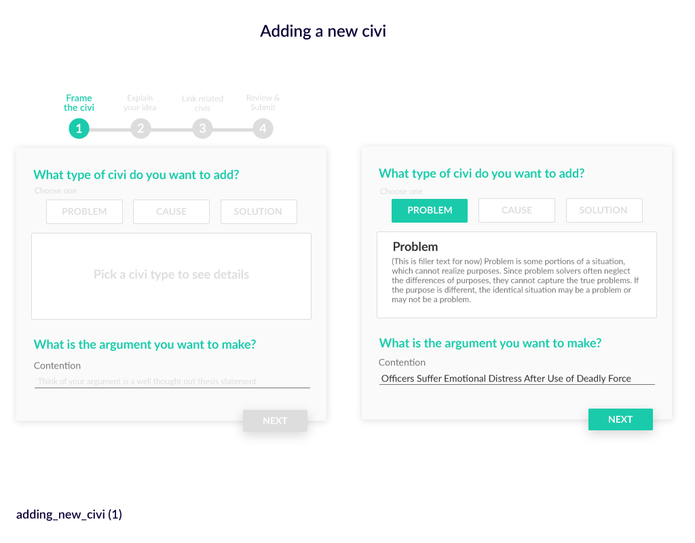

The first step in the add Civi form allows you to select the type of Civi you are adding, and write the title, or contention for the Civi you are adding. As you toggle through the type of Civi, the form displays the purpose of that Civi. For example, a problem Civi is meant to identify a tangible harm, causes identify a reason for that harm, and solutions identify particular policies which could resolve one or more identified causes. 

You also frame your Civi with a contention. This 140 character title is the statement that the user agrees or disagrees with. Nothing at this stage is editable after the Civi is published. 

## Add a Civi (Step 2) 
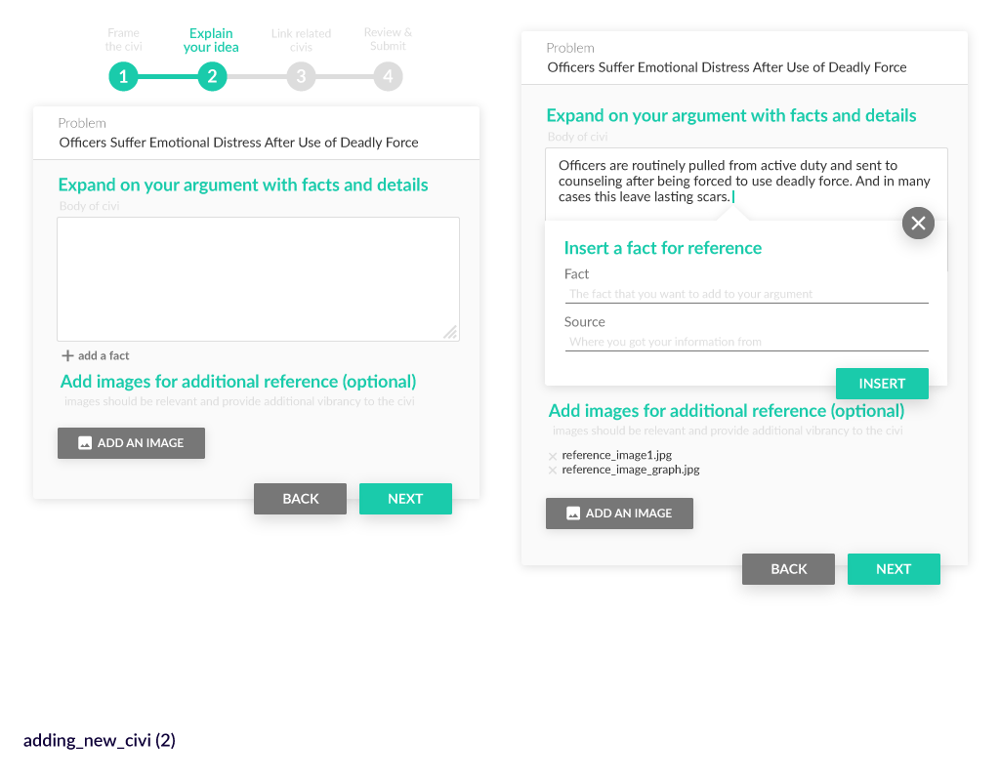

The second step in the add Civi form allows the user to fill in the body of the Civi, add cited sentences and add relevant images. This sections contains all the supporting material for the contention made in part one and can be edited even after the Civi is published. 

## Adding a Civi (Step 3) 
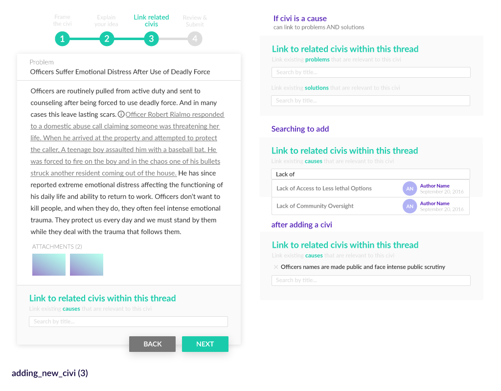

In step 3 of adding a Civi, the user links their new Civi to Civies it is the problem for, the cause of, or the solution for. 

For main thread Civies, they can link to any Civi adjacent in the thread (i.e. problem and cause, cause and solution). And for response civies, the Civi can only reference the Civi it is responding to and one Civi at the same level as the response(i.e. Problem Civi responses can only link to another problem). 
The whole thread is still available so the user can  scroll through the main content of the thread, or the outline to view relevant Civies. Additionally, they can conduct a keyword search to find relevant Civies. 

**Update:** Need to display a list of possible civies to link to (No need to link Problems, show all problems when creating causes, show all causes when creating solutions 

## Adding a Civi (Step 4)

Finally, the user’s completed Civi is displayed for review. This is the last stage to edit the Civi’s contention. And it attempts to impress the importance of reviewing their content before posting. 

## Adding a Response/Rebuttal Civi
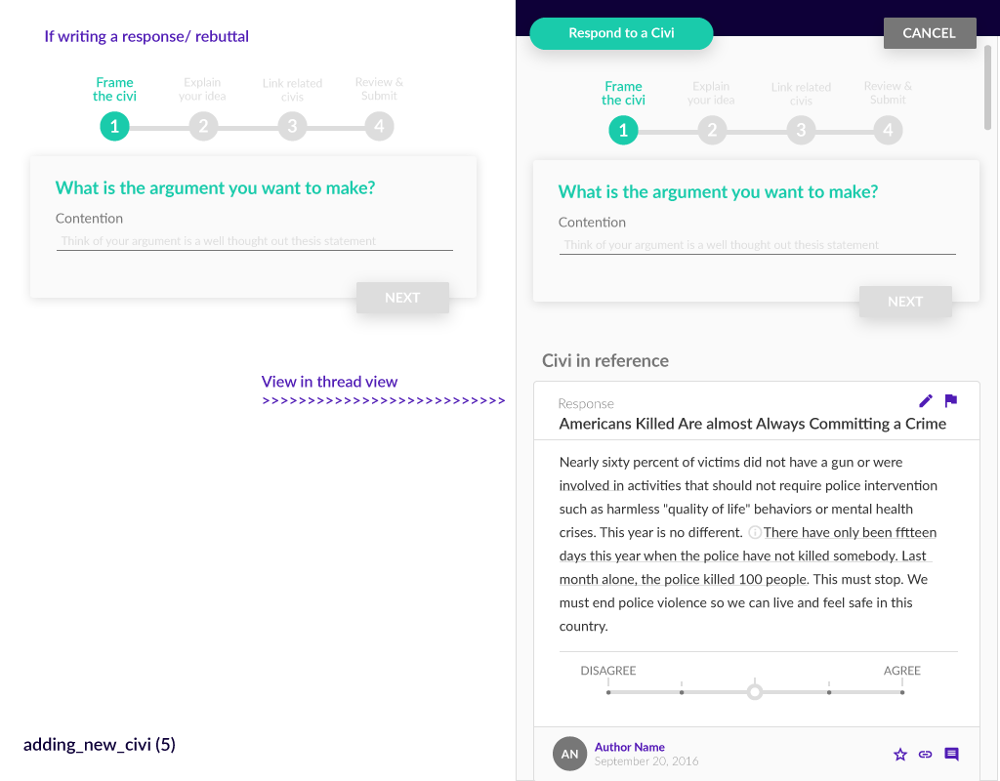

Adding a response/rebuttal Civi is almost identical to adding a main thread Civi. The only difference is that in those cases, the Civi that is being responded/rebutted is shown at the bottom of the editing screen for quick reference

**Note1:** in the case of a rebuttal, the user will likely be responding to a notification. 
**Note2:** outdated Styling “Response Civi bubble”

## The User Account - Civies Tab
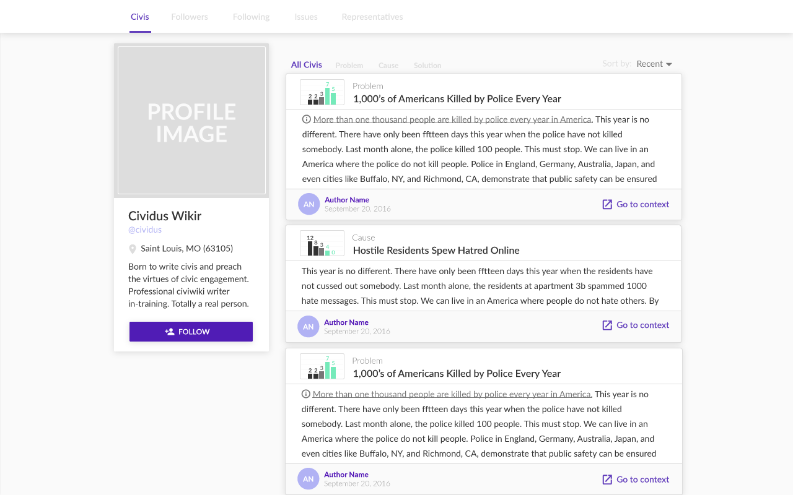

The user page has a Twitter like left column with basic information about the user, a follow button,  a set of tabs to select the content to view, and open right space for us to integrate suggestions or donation requests. 

The home tab for the user account is a summary list of recent Civies which can be sorted by problem, cause or solution. The summaries of the civies display statistics on the popularity of the Civi. The users can select go to context to see the Civi in the thread for editing. This tab is public by default. 

**Note1:** styling preference: darker tabs bar and detailed voting information showing how many users voted on each of the 5 rating options. 
**Note2:** add mock up of page with individual Civi, button to see full thread and social media sharing tools. 

## User Account - Followers/Following
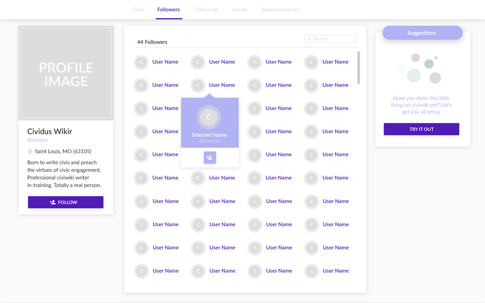

Similar to Twitter, users will have pages with a searchable list of the accounts following them and the accounts they follow. 

**Note:** same general styling changes as “Civies Tab”.

## Issues Tab

The issues tab displays summary popouts of all the issues articles you have read. These will link you to the issue article, and when expanded will show you the solutions you voted on with status on the bill if available. 

**Note1:** same styling changes as above, rather than general sort. Add sort toggle call importance where user has the ability to reorder issues by their importance to the user.
**Note2:** consider also tracking solutions/bills you have disagreed with. 

## User Account - Representatives Tab

The representatives tab displays a % agreement based on how often the representative voted in line with your support or opposition to particular bills (as tracked by the sunlight foundation api). If the representative's name is clicked, you can visit their accounts page. This page is private to the user. 

**Note:** same styling changes as above

**A Note on Representatives Accounts (Distinct from a User Account) in General**

Representatives initial accounts will be similar to a user account with several exceptions 
1. They will also have a voting statements tab with a list of voting statements on bills.
2. Their issues page will display top issues based on their district’s voting with voting statistics for solutions only reflecting their district’s users
3. They will be able to add bills to other users solution Civies
4. Any post boost caused by following is applied by default to their posts by all the users in their district (unless blocked)
5. All their content is public

## Representative Accounts Page - Bills 

One unique page for Representatives displays popular bills (based on the number of users supporting solution Civies they are tagged on). This page will allow the Representative to add a voting statement to these bills 

**Note:** the ranking of these bills should use the sunlight api to find upcoming votes. (Might need a search bar) 

